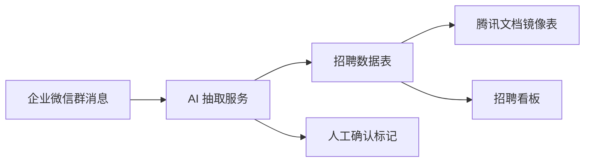

# 基于 AI 的招聘数据自动化记录与同步方案

## 1. 背景与痛点

招聘协作中，HR 的日常载体主要是企业微信、企业微信群和腾讯在线文档。候选人推荐、面试安排、流程反馈等信息通常先出现在群聊中，再由 HR 手动整理到在线文档。

这个流程存在明显低效点：

- 人工录入耗时：HR 需要反复复制、整理、补字段。
- 数据容易遗漏：群聊消息非结构化，候选人阶段、面试时间、面试官等字段容易漏记。
- 更新不及时：群里已经推进到面试或复试，文档和看板仍停留在旧状态。
- 统计依赖人工：招聘漏斗、待办、同步记录需要 HR 手动维护。

## 2. 方案目标

在最小成本预算下，建设一个 AI 自动化同步 Demo，不改变 HR 当前使用企业微信和腾讯文档的习惯。

目标链路：

```text
企业微信群消息 -> AI 结构化抽取 -> 招聘数据入库 -> 腾讯文档镜像同步 -> 招聘看板更新
```

目标效果：

- 自动记录招聘数据，替代重复手工录入。
- 实时同步候选人状态，减少文档滞后。
- 可视化展示招聘进度和异常待确认数据。
- 对低置信度结果保留人工确认，降低 AI 抽取风险。

## 3. Demo 功能设计

### 数据采集

“数据采集”页面模拟企业微信群消息输入。HR 可以选择示例消息，也可以粘贴真实招聘群消息。

示例输入：

```text
@HR 张三 Java后端 3年经验 本科，简历已收，约周三14:00初面，面试官王经理
```

### AI 结构化抽取

系统自动抽取：

- 候选人姓名
- 应聘岗位
- 学历
- 工作年限
- 当前招聘阶段
- 面试时间
- 面试官
- 负责人
- 来源群
- 置信度
- 是否需要人工确认

示例输出：

```json
{
  "candidate_name": "张三",
  "position_name": "Java后端",
  "education": "本科",
  "work_years": 3,
  "stage": "初面",
  "interview_time": "周三14:00",
  "interviewer": "王经理",
  "owner": "招聘助理",
  "source_channel": "企业微信-招聘群",
  "confidence": 0.92,
  "needs_review": false
}
```

### 腾讯文档镜像同步

Demo 阶段使用数据库表模拟腾讯在线文档，展示候选人、岗位、当前阶段、面试时间、负责人、来源、同步状态和更新时间。

正式落地时，只需要把当前同步适配器替换为腾讯文档 API 写入逻辑。

### 招聘看板

工作台展示：

- 今日自动采集数
- 文档同步总数
- 需人工确认数
- 待面试候选人数
- 最近同步动态

## 4. AI 工具与模型应用

系统优先调用 Qwen 模型进行结构化抽取，要求模型输出固定字段。为了保证 Demo 和业务稳定性，系统也提供规则兜底：

- 无 `QWEN_API_KEY` 时自动走规则解析。
- 模型调用失败时自动走规则解析。
- 规则解析结果默认标记 `needs_review=true`。
- 低置信度结果进入人工确认队列。

这种设计可以让 Demo 不依赖模型服务可用性，也符合真实业务中“AI 辅助、人可兜底”的原则。

## 5. 系统架构



核心模块：

- 前端数据采集页：负责消息输入、抽取结果展示、文档镜像展示。
- 后端 Intake API：负责解析消息、落库、同步文档镜像。
- AI 抽取服务：负责大模型调用与规则兜底。
- 招聘看板：负责展示采集统计和同步动态。

## 6. 最小成本落地

本方案不要求替换企业现有招聘系统，也不要求改变 HR 工作习惯。

低成本点：

- 继续使用企业微信作为消息入口。
- 继续使用腾讯在线文档作为协作载体。
- 只增加一个轻量 AI 同步服务。
- 模型按量调用，低置信度交给人工确认。
- Demo 可本地运行，正式环境可部署到企业现有服务器。

正式接入路径：

- 企业微信侧：群机器人 Webhook、审批回调、消息转发服务。
- 腾讯文档侧：腾讯文档开放 API。
- 数据幂等：使用候选人手机号、简历 ID 或姓名+岗位组合做更新键。

## 7. Demo 演示路径

1. 启动前后端。
2. 点击“演示模式登录”。
3. 进入 `/intake` 数据采集页面。
4. 选择企业微信群示例消息。
5. 点击“AI 解析并同步”。
6. 查看 AI 抽取结果。
7. 查看腾讯文档镜像表新增行。
8. 进入 `/dashboard` 查看统计和最近同步动态。

## 8. 后续迭代

- 接入真实企业微信群机器人 Webhook。
- 接入腾讯文档 API，实现真实在线表格更新。
- 增加候选人去重和岗位 ID 绑定。
- 增加字段级人工确认。
- 增加招聘漏斗、岗位达成率、面试转化率等分析指标。
